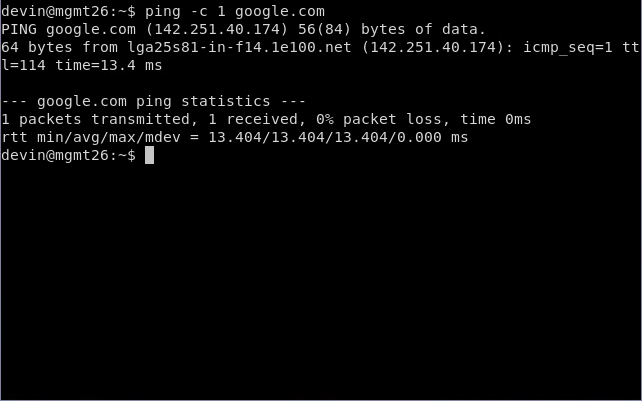

# Milestone 1

## Overview 🌎

* **Access IPMI & Install ESXI**

* **Configure Data Stores**

* **Configure Firewall & Management Systems**

## Current Network Diagram

> Diagram made in plantuml [here](network.plantuml)

## Accessing IPMI
1. Put IPMI network address for micro in browser & log in with creds
2. Select remote control -> IKVM/HTML5 and press the button to view the console
3. Plug in USB and select it as boot media via f12 bios menu
4. Install ESXI from boot media

 ## Configuring Data Stores 🏬
 I only had one datastore so I renamed it to `datastore-super26` Upload ISOs to this datastore. 

 ## Virtual Networking 🕸️
 We already have the VM network that will connect out virtual systems to the Freeman network, however we want an internal network for our VMs. 
 1. Add a virtaul switch, this one is called `350-internal`
 2. Create a port group named `350-internal` and add it to the `350-internal` virtual switch. 


## Creating a VM
The first system we will want is a firewall for our virtual network. In this instance we are using `pfsense`.
1. Create a vm from the pfsense ISO that was uploaded with the following config
```
ther FreeBSD (64-bit) 12+
put this on datastore2!
1cpu, 2GiB RAM, 8gb disk
```

**Setting up pfsense**
1. WAN ip should be from network assignments in my case it is `192.168.3.36`
2. WAN gateway should point to freeman gateway `192.168.3.250`
3. LAN ip should be `10.0.17.2/24`

**Setting up MGMT**
Setting up `MGMT` will allow for final firewall completion
1. create mgmt vm and assign its network settings like the following:
```
hostname: mgmt-01
IPv4: 10.0.17.100
Gateway: 10.0.17.2
Subnet: 255.255.255.0
DNS: 1.1.1.1
```
2. Finish completing the firewall setup via web portal on 10.0.17.2

**If everything goes right you should be able to ping IPs from MGMT**
