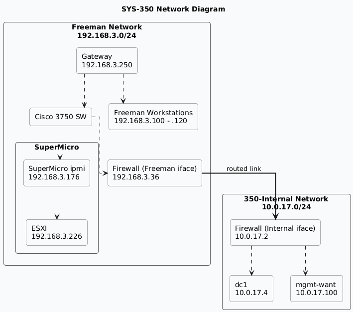

# Milestone 2

## Overview 🌎

* **Setup Windows Server for `sysprep`**
* **Download and install AD on new windows VM**

## Current Network Diagram

> Diagram made in plantuml [here](network.plantuml)

## Configuring Windows Server for Sysprep
1. Type `sconfig` in powershell
2. Use option 6 to download and install updates ultill there are none left
3. Make sure to set time zone & configure updates with what the system requires
4. Install VMware Tools through the actions menu in ESXi

## Sysconfig